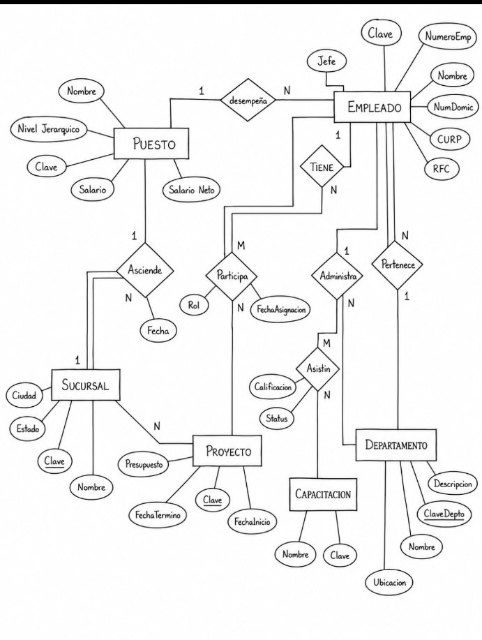
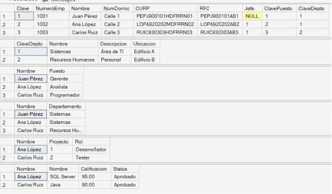
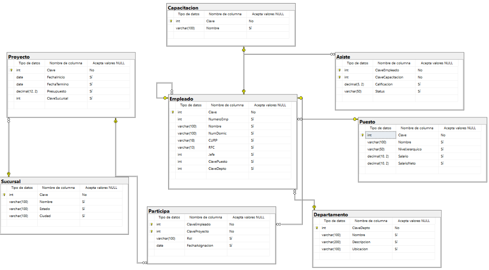

# Base de Datos Empresa

## Diagrama Entidad-Relación


## Script SQL

```sql
CREATE DATABASE Empresa;
GO

USE Empresa;
GO

CREATE TABLE Puesto(
    Clave INT PRIMARY KEY,
    Nombre VARCHAR(100),
    NivelJerarquico VARCHAR(50),
    Salario DECIMAL(10,2),
    SalarioNeto DECIMAL(10,2)
);

CREATE TABLE Departamento(
    ClaveDepto INT PRIMARY KEY,
    Nombre VARCHAR(100),
    Descripcion VARCHAR(200),
    Ubicacion VARCHAR(100)
);

CREATE TABLE Sucursal(
    Clave INT PRIMARY KEY,
    Nombre VARCHAR(100),
    Estado VARCHAR(100),
    Ciudad VARCHAR(100)
);

CREATE TABLE Capacitacion(
    Clave INT PRIMARY KEY,
    Nombre VARCHAR(100)
);

CREATE TABLE Proyecto(
    Clave INT PRIMARY KEY,
    FechaInicio DATE,
    FechaTermino DATE,
    Presupuesto DECIMAL(12,2),
    ClaveSucursal INT,
    FOREIGN KEY(ClaveSucursal)
    REFERENCES Sucursal(Clave)
);

CREATE TABLE Empleado(
    Clave INT PRIMARY KEY,
    NumeroEmp INT,
    Nombre VARCHAR(100),
    NumDomic VARCHAR(100),
    CURP VARCHAR(18),
    RFC VARCHAR(13),
    Jefe INT,
    ClavePuesto INT,
    ClaveDepto INT,
    FOREIGN KEY(Jefe) REFERENCES Empleado(Clave),
    FOREIGN KEY(ClavePuesto) REFERENCES Puesto(Clave),
    FOREIGN KEY(ClaveDepto) REFERENCES Departamento(ClaveDepto)
);

CREATE TABLE Participa(
    ClaveEmpleado INT,
    ClaveProyecto INT,
    Rol VARCHAR(100),
    FechaAsignacion DATE,
    PRIMARY KEY(ClaveEmpleado,ClaveProyecto),
    FOREIGN KEY(ClaveEmpleado) REFERENCES Empleado(Clave),
    FOREIGN KEY(ClaveProyecto) REFERENCES Proyecto(Clave)
);

CREATE TABLE Asiste(
    ClaveEmpleado INT,
    ClaveCapacitacion INT,
    Calificacion DECIMAL(5,2),
    Status VARCHAR(50),
    PRIMARY KEY(ClaveEmpleado,ClaveCapacitacion),
    FOREIGN KEY(ClaveEmpleado) REFERENCES Empleado(Clave),
    FOREIGN KEY(ClaveCapacitacion) REFERENCES Capacitacion(Clave)
);
```

## Consulta

```sql
SELECT *
FROM Empleado E
INNER JOIN Puesto P
ON E.ClavePuesto = P.Clave;

SELECT *
FROM Empleado E
INNER JOIN Departamento D
ON E.ClaveDepto = D.ClaveDepto;

SELECT *
FROM Proyecto PR
INNER JOIN Sucursal S
ON PR.ClaveSucursal = S.Clave;

SELECT *
FROM Participa PA
INNER JOIN Empleado E
ON PA.ClaveEmpleado = E.Clave
INNER JOIN Proyecto PR
ON PA.ClaveProyecto = PR.Clave;

SELECT *
FROM Asiste A
INNER JOIN Empleado E
ON A.ClaveEmpleado = E.Clave
INNER JOIN Capacitacion C
ON A.ClaveCapacitacion = C.Clave;
```
## tablas 

## diagrama sql

